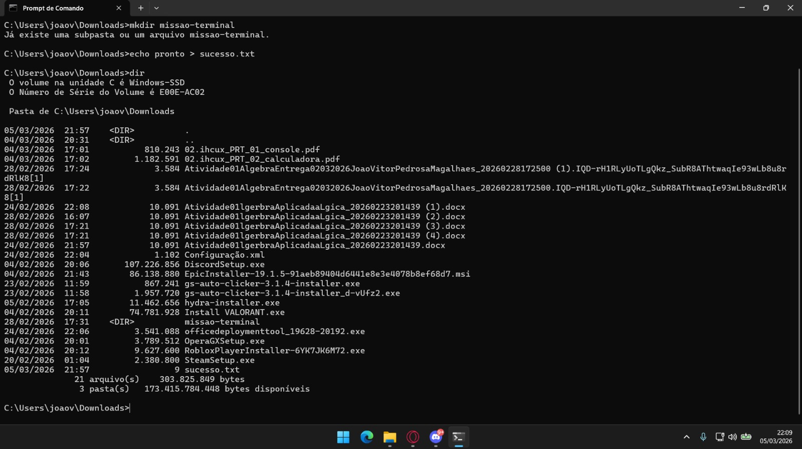

# ⚡ Meus Comandos Favoritos
Aqui estão os comandos que mais utilizei na aula de Terminal:

- `cd`: Para navegar entre pastas.
- `dir`: Para listar arquivos.
- `mkdir` Para criar pastas
- `systeminfo` Para mostrar info do sistema
- `echo` Para escrever texto ou criar arquivos

## 📸 Evidência de Execução

